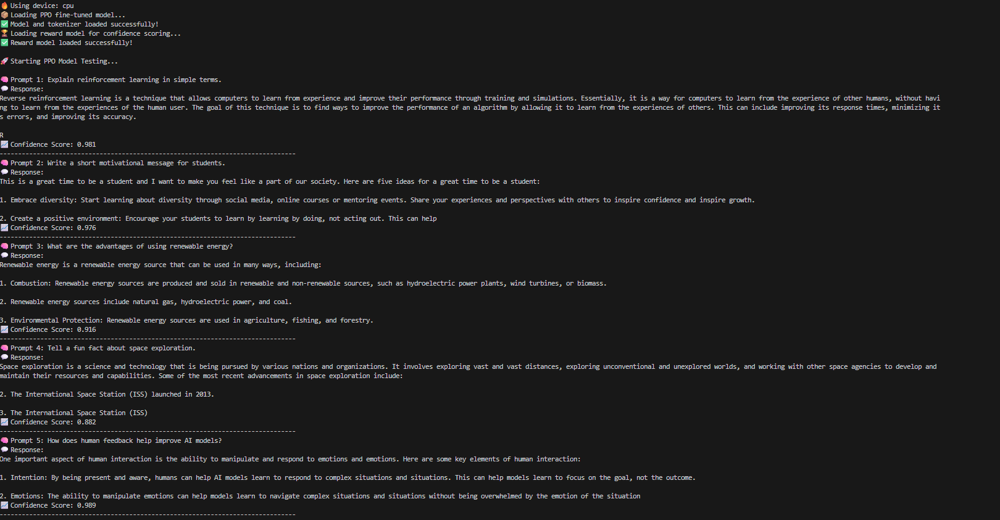

# 🧠 RLHF Training Pipeline (From Scratch)

This project implements a **Reinforcement Learning with Human Feedback (RLHF)** pipeline, consisting of:

1. **Policy Model** — fine-tuned on instructions
2. **Reward Model** — learns to prefer better responses
3. **PPO Fine-tuning** — optimizes the policy with reward signals
4. **Testing** — to validate and chat with the final PPO model

Built entirely with **PyTorch** + **Hugging Face Transformers** 🚀

---

## 🗂️ Folder Structure

```
RLHF Project/
│
├── data/
│   ├── raw/                     # Downloaded raw datasets (Yahma/Alpaca-Cleaned)
│   ├── processed/
│   │   ├── accepted_data.jsonl  # Human-approved (good) responses
│   │   ├── rejected_data.jsonl  # Human-rejected (bad) responses
│
├── models/
│   ├── policy/                  # Fine-tuned base model
│   ├── reward/                  # Trained reward model checkpoint
│   ├── ppo/                     # PPO fine-tuned model
│
├── scripts/
│   ├── policy_model.py          # Step 1: Train policy model
│   ├── reward_model.py          # Step 2: Train reward model
│   ├── ppo_model.py             # Step 3: PPO fine-tuning
│   ├── test_ppo_model.py        # Step 4: Test PPO model
│
├── requirements.txt
├── .venv/
└── README.md
```

---

## ⚙️ Environment Setup

### 1️⃣ Create a Virtual Environment

```bash
python -m venv .venv
```

Activate it:

**Windows:**

```bash
.venv\Scripts\activate
```

**Linux/macOS:**

```bash
source .venv/bin/activate
```

---

### 2️⃣ Install Dependencies

```bash
pip install -r requirements.txt
```

**Example `requirements.txt`:**

```
torch
transformers
datasets
tqdm
```

---

## 🧩 Data Setup

Before running the training scripts, you must create the folders and download the dataset.

### 1️⃣ Create Folders

```bash
mkdir -p data/raw data/processed models/policy models/reward models/ppo scripts
```

### 2️⃣ Download Dataset (Yahma/Alpaca-Cleaned)

This dataset will serve as the base for policy and reward model training.

Make sure you have **Git LFS** installed:

```bash
git lfs install
```

Then, download the dataset into the `data/raw` directory:

```bash
cd data/raw
git clone https://huggingface.co/datasets/yahma/alpaca-cleaned
cd ../../
```

After this step, your `data/raw/alpaca-cleaned` folder will contain the original instruction–response pairs.

---

## 🧠 RLHF Training Flow

### �\dfe2 Step 1: Train Policy Model

Fine-tune the base model (like GPT-2) on the Alpaca dataset.

```bash
python scripts/policy_model.py
```

➡️ Output: `models/policy/`

---

### 🟡 Step 2: Train Reward Model

Train a DistilBERT-based reward model on **accepted vs rejected** responses.

```bash
python scripts/reward_model.py
```

➡️ Output: `models/reward/reward_model.pt`

---

### 🔴 Step 3: PPO Fine-Tuning

Perform Proximal Policy Optimization (PPO) using the trained reward model.

```bash
python scripts/ppo_model.py
```

➡️ Output: `models/ppo/`

---

### 🧪 Step 4: Test PPO Model

Interactively test or evaluate the fine-tuned PPO model.

```bash
python scripts/test_ppo_model.py
```

🧠 Example Output:




---

## 🧪 Optional: Run All Steps in Sequence

To automate the full RLHF flow:

```bash
python scripts/policy_model.py && \
python scripts/reward_model.py && \
python scripts/ppo_model.py && \
python scripts/test_ppo_model.py
```

---

## ⚡ GPU Check

Ensure CUDA is available before training:

```bash
python -c "import torch; print(torch.cuda.is_available())"
```

If `True`, GPU training is enabled ✅

---

## 🏁 Summary

| Step | Script              | Description           | Output                          |
| ---- | ------------------- | --------------------- | ------------------------------- |
| 1️⃣  | `policy_model.py`   | Fine-tunes base LLM   | `models/policy/`                |
| 2️⃣  | `reward_model.py`   | Trains reward scorer  | `models/reward/reward_model.pt` |
| 3️⃣  | `ppo_model.py`      | RLHF PPO fine-tuning  | `models/ppo/`                   |
| 4️⃣  | `test_ppo_model.py` | Chat & test PPO model | Console output                  |

---

## ❤️ Credits

Built using:

* [PyTorch](https://pytorch.org/)
* [Hugging Face Transformers](https://huggingface.co/transformers)
* [Yahma/Alpaca-Cleaned Dataset](https://huggingface.co/datasets/yahma/alpaca-cleaned)
* PPO and RLHF ideas inspired by [OpenAI InstructGPT](https://arxiv.org/abs/2203.02155)
